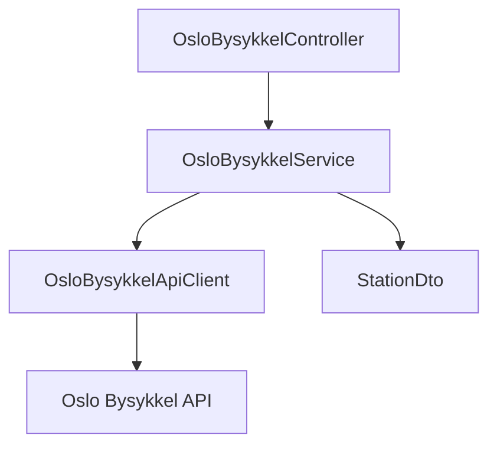

# Caseoppgave: Oslo Bysykkel API
.NET 8.0 Web API for henting av data fra Oslo Bysykkel API. APIet har ett endepunkt, som returnerer alle Oslo Bysykkel-stasjoner med tilgjengelige sykler og låser.

```http
GET https://localhost:<port>/api/OsloBysykkel/stations
```
Eksempel på respons:

```json
[
  {
    "stationId": "123",
    "numBikesAvailable": 5,
    "numDocksAvailable": 10,
    "name": "Stortorvet",
    "address": "Stortorvet 1"
  }
]
```
## Hvordan kjøre prosjektet

### Forutsetninger

Installer .NET 8 SDK:

- [.NET 8 SDK](https://dotnet.microsoft.com/download)

Sjekk at .NET er installert ved å hente versjonen:

```bash
dotnet --version
```

### Start applikasjonen
Naviger til prosjektmappen og bruk følgende kommando for å kjøre applikasjonen
```
dotnet run
```

API-endepunktet kan testes med Swagger ved å gå til [https://localhost:<port>/swagger](https://localhost:<port>/swagger)

## Arkitektur


